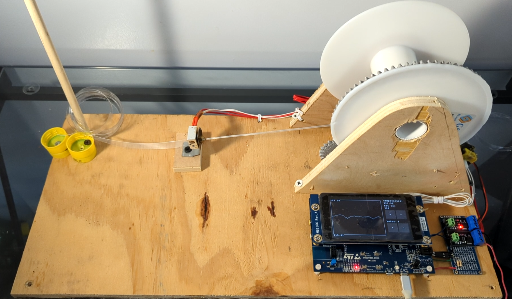
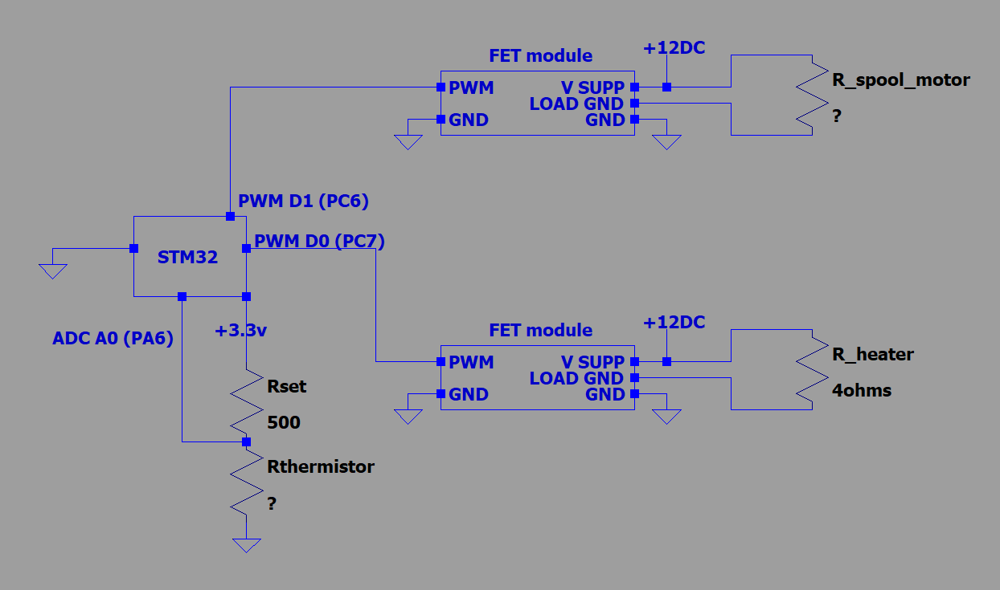
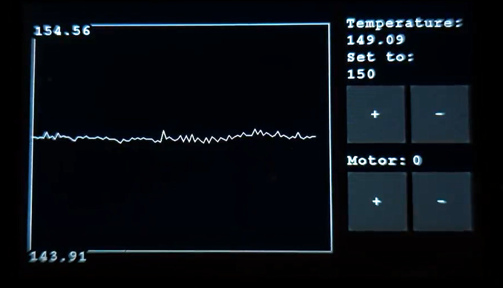

# 3D Printer Filament Maker (PET)

# Overview
This project utilizes a stm32 dev board (model stm32f769i) to control the peripherals of a 3d printer filament maker. The filament maker uses strips from a **PET bottle** to create 1.75mm filament that is usable for 3d printing. I created a DIY series in this [Youtube Playlist](https://youtube.com/playlist?list=PLJOMKOpHvdRodi5pEqKaXuxK7yjw8OrsN) to show how this machine was made. The machine consists of peripherals such as a display, motor and a heading element. For more build information, refer to the playlist above. 

# Hardware
- STM32 device - model stm32f769i
- FET Module (Connected to pins PC6, PC7)
- Heater block from 3d printer
- Low RPM DC motor 

# Methodology
Utilizing the STM32 device with built-in screen, we are able to control the motor speed as well as the temperature of the heating element from our project. The microcontroller controls the heating element using a PWM signal, created by an internal timer. This heater control is PID tuned to the element I was using, and can be configured to fit your needs. There is a display to the left of the controls that shows a graph of the temperature. The motor is also driven by PWM, and both can be controlled with the touch screen upon startup. The outputs of the heater and motor are PC7 and PC6 respectively (on device stm32f769i), and will need to be connected to external FET drivers to provide power to the actual peripheral. Additionally, the feedback thermistor is connected to PA6 in my case. The thermistor being used for my block is a 100k, so a voltage divider circuit was chosen appropriately to recieve the highest resolution termperature reading for the temperatures of around 200c, see videos for details. Below shows the machine in its entirety.

# Installation

This program will require a proper setup of the IDE: [STM32CubeIDE](https://www.st.com/en/development-tools/stm32cubeide.html) and configuration/inclusion of additional support libraries such as init.h, math.h and lcd drivers if possible. Be sure to configure this code to the correct device you have chosen to run this on. 

# Wiring
See the image below to see how this was wired. The output pins were connected to FET modules of my choosing, but any suitable FET modules will work fine. For the thermistor voltage divider, choose an appropriate resistor according to the thermistor resistance that came with your heater block. 

# Usage

To run this program, compile and upload the bitstream to the stm32 device using STM32CubeIDE. Then, be sure to enable your external power supply (12v), and control the temperature/motor speed using the touch screen provided. 

